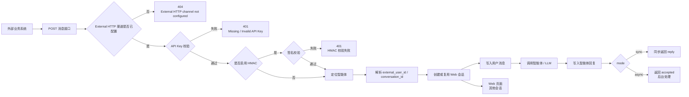

# 外部 HTTP 智能体调用开发文档

更新时间：2026-06-08

## 1. 功能概述

外部 HTTP 渠道用于让外部业务系统通过 HTTP 请求指定 Clawith 智能体，并把请求内容写入该智能体的会话记录中。

典型场景：

- 订单系统把订单异常发送给指定智能体分析。
- 工单系统把用户问题发送给指定智能体处理。
- 内部业务系统按流程实例 ID 调用智能体生成建议。
- 外部系统希望在 Web 页面中查看每次调用的上下文和回复记录。

核心能力：

- 通过 URL 中的 `agent_id` 指定智能体。
- 通过 API Key 鉴权。
- 可选 HMAC-SHA256 签名校验。
- 支持同步返回智能体回复。
- 支持异步接收请求并后台处理。
- 请求和回复会写入 Web 页面“其他会话”中，便于查看和管理。

## 2. 整体流程



## 3. 前置条件

外部业务系统调用前，必须先为目标智能体配置 External HTTP 渠道。

配置方式有两种：

1. 在 Web 页面中配置。
2. 使用管理接口配置。

### 3.1 Web 页面配置

进入目标智能体详情页：

1. 打开智能体设置。
2. 找到渠道配置。
3. 展开“External HTTP / 外部 HTTP”。
4. 配置参数。
5. 点击保存。
6. 复制页面返回的 `API Key`。
7. 如果启用 HMAC，还需要复制 `签名密钥`。

注意：

- `API Key` 只在创建或重新生成时显示一次。
- 如果遗失 API Key，需要重新生成，旧 API Key 会失效。

### 3.2 管理接口配置

接口：

```http
POST /api/agents/{agent_id}/external-http-channel
```

鉴权：

```http
Authorization: Bearer 登录用户 JWT
```

只有智能体创建者或有权限的管理员可以配置。

请求示例：

```bash
curl -X POST 'http://172.16.2.101:3008/api/agents/9cc201ff-3df9-4df1-8c7f-e5b0e6ac2f17/external-http-channel' \
  -H 'Authorization: Bearer 你的登录JWT' \
  -H 'Content-Type: application/json' \
  -d '{
    "require_hmac": false,
    "sync_timeout_seconds": 120,
    "max_payload_bytes": 65536,
    "regenerate_api_key": true
  }'
```

返回示例：

```json
{
  "id": "channel-config-id",
  "agent_id": "9cc201ff-3df9-4df1-8c7f-e5b0e6ac2f17",
  "channel_type": "external_http",
  "is_configured": true,
  "is_connected": true,
  "extra_config": {
    "require_hmac": false,
    "sync_timeout_seconds": 120,
    "max_payload_bytes": 65536,
    "auth_scheme": "bearer",
    "signature": "HMAC-SHA256 over '<x-timestamp>.<raw-body>' in X-Signature-SHA256"
  },
  "api_key": "ext-真实APIKey",
  "webhook_url": "http://172.16.2.101:3008/api/channel/external-http/9cc201ff-3df9-4df1-8c7f-e5b0e6ac2f17/message"
}
```

## 4. 配置参数说明

| 参数 | 中文名称 | 类型 | 默认值 | 说明 |
| --- | --- | --- | --- | --- |
| `require_hmac` | 是否启用 HMAC 签名 | boolean | `false` | `true` 时，请求必须带 `X-Timestamp` 和 `X-Signature-SHA256`。 |
| `sync_timeout_seconds` | 同步等待超时时间（秒） | integer | `120` | `mode=sync` 时等待智能体回复的最长时间，范围 5-300。 |
| `max_payload_bytes` | 最大请求体大小（字节） | integer | `65536` | 限制单次 JSON Body 大小，范围 1024-1048576。 |
| `regenerate_api_key` | 重新生成 API Key | boolean | `false` | `true` 时生成新的外部调用密钥，旧 API Key 失效。 |
| `regenerate_signing_secret` | 重新生成签名密钥 | boolean | `false` | `true` 时生成新的 HMAC 签名密钥。 |

## 5. 外部消息接口

接口：

```http
POST /api/channel/external-http/{agent_id}/message
```

完整示例：

```bash
curl -X POST 'http://172.16.2.101:3008/api/channel/external-http/9cc201ff-3df9-4df1-8c7f-e5b0e6ac2f17/message' \
  -H 'Authorization: Bearer ext-真实APIKey' \
  -H 'Content-Type: application/json' \
  -d '{
    "content": "测试消息",
    "external_user_id": "biz-user-001",
    "external_user_name": "业务系统用户",
    "conversation_id": "order-20260608-0001",
    "metadata": {
      "source": "order-system",
      "order_id": "20260608-0001"
    },
    "mode": "sync"
  }'
```

### 5.1 请求头

| Header | 必填 | 说明 |
| --- | --- | --- |
| `Authorization` | 是 | 格式为 `Bearer ext-真实APIKey`。 |
| `Content-Type` | 是 | 固定为 `application/json`。 |
| `X-Timestamp` | 启用 HMAC 时必填 | Unix 秒级时间戳。 |
| `X-Signature-SHA256` | 启用 HMAC 时必填 | HMAC-SHA256 签名，格式为 `sha256=签名值`。 |

也可以使用 `X-API-Key` 传 API Key：

```http
X-API-Key: ext-真实APIKey
```

优先推荐使用 `Authorization: Bearer ...`。

### 5.2 请求体

| 字段 | 中文名称 | 类型 | 必填 | 说明 |
| --- | --- | --- | --- | --- |
| `content` | 消息内容 | string | 是 | 发送给智能体的文本，最大 60000 字符。 |
| `external_user_id` | 外部用户 ID | string | 否 | 外部系统中的用户标识，默认 `external`。 |
| `external_user_name` | 外部用户名称 | string | 否 | 用于 Web 会话中显示调用方。 |
| `conversation_id` | 外部会话 ID | string | 否 | 控制是否合并到同一个 Web 会话。 |
| `metadata` | 业务元数据 | object | 否 | 订单号、工单号、来源系统等附加信息，会附加给智能体参考。 |
| `mode` | 调用模式 | string | 否 | `sync` 或 `async`，默认 `sync`。 |

### 5.3 响应示例

同步调用成功：

```json
{
  "ok": true,
  "request_id": "225e7600-8247-46ae-8fbe-df29f5951c8d",
  "session_id": "d5c9ba46-c884-4569-a606-4f2867835581",
  "reply": "智能体回复内容"
}
```

异步调用成功：

```json
{
  "ok": true,
  "status": "accepted",
  "request_id": "225e7600-8247-46ae-8fbe-df29f5951c8d"
}
```

## 6. HMAC 签名算法

启用 `require_hmac=true` 后，外部系统必须对原始请求体签名。

签名原文：

```text
{X-Timestamp}.{raw-body}
```

算法：

```text
HMAC-SHA256(signing_secret, signed_payload)
```

请求头：

```http
X-Timestamp: 1780900000
X-Signature-SHA256: sha256=计算出的hex签名
```

curl 示例：

```bash
AGENT_ID='9cc201ff-3df9-4df1-8c7f-e5b0e6ac2f17'
API_KEY='ext-真实APIKey'
SIGNING_SECRET='真实签名密钥'
BASE_URL='http://172.16.2.101:3008'

BODY='{
  "content": "测试消息",
  "external_user_id": "biz-user-001",
  "conversation_id": "order-20260608-0001",
  "mode": "sync"
}'

TS=$(date +%s)
SIG=$(printf '%s.%s' "$TS" "$BODY" \
  | openssl dgst -sha256 -hmac "$SIGNING_SECRET" -hex \
  | awk '{print $2}')

curl -X POST "$BASE_URL/api/channel/external-http/$AGENT_ID/message" \
  -H "Authorization: Bearer $API_KEY" \
  -H "X-Timestamp: $TS" \
  -H "X-Signature-SHA256: sha256=$SIG" \
  -H "Content-Type: application/json" \
  -d "$BODY"
```

注意：

- 签名必须基于原始 JSON 字符串。
- 计算签名前后不要改变空格、换行、字段顺序。
- 服务端允许时间偏差为 300 秒。

## 7. 会话归并规则

外部 HTTP 请求会写入 Web 页面中的会话记录。

会话归并规则：

| 请求情况 | Web 会话行为 |
| --- | --- |
| 同一个 `agent_id` + 同一个 `conversation_id` | 合并到同一个会话。 |
| 同一个 `agent_id` + 每次不同 `conversation_id` | 每次创建独立会话。 |
| 不传 `conversation_id` | 按 `external_user_id` 合并。 |

后端内部会话键：

```text
external_http:{conversation_id 或 external_user_id}
```

示例：每个订单一个会话。

```json
{
  "content": "请分析订单异常",
  "external_user_id": "biz-user-001",
  "conversation_id": "order-20260608-0001",
  "mode": "sync"
}
```

示例：每次请求一个独立会话。

```bash
conversation_id="req-$(date +%s)"
```

示例请求：

```bash
curl -X POST 'http://172.16.2.101:3008/api/channel/external-http/{agent_id}/message' \
  -H 'Authorization: Bearer ext-真实APIKey' \
  -H 'Content-Type: application/json' \
  -d "{
    \"content\": \"测试消息\",
    \"external_user_id\": \"biz-user-001\",
    \"conversation_id\": \"req-$(date +%s)\",
    \"mode\": \"sync\"
  }"
```

## 8. Web 页面查看会话

外部 HTTP 请求创建的会话会显示在智能体详情页的“其他会话 / 其他用户会话”中。

原因：

- 外部 HTTP 请求会被视为外部渠道用户发起。
- `external_user_id` 会映射为平台内的渠道用户。
- 因为它不是当前网页登录用户自己的 Web 会话，所以不会出现在“我的会话”。
- 智能体创建者、管理员可以在“其他会话”中查看。

会话来源：

```text
source_channel = external_http
```

页面建议：

- 外部系统测试时使用清晰的 `external_user_name`。
- 使用业务对象 ID 作为 `conversation_id`，例如订单号、工单号、流程实例 ID。
- 如果希望页面中每条请求都独立展示，必须让 `conversation_id` 每次唯一。

## 9. 错误码与排障

### 9.1 404 External HTTP channel not configured

原因：

- 目标智能体未配置 External HTTP 渠道。
- URL 中的 `agent_id` 写错。
- 配置后又删除了渠道。

处理：

1. 确认智能体 ID 正确。
2. 在 Web 页面保存 External HTTP 渠道。
3. 或调用配置接口生成渠道。

检查接口：

```bash
curl -X GET 'http://172.16.2.101:3008/api/agents/{agent_id}/external-http-channel' \
  -H 'Authorization: Bearer 登录JWT'
```

### 9.2 401 Missing external HTTP channel API key

原因：

- 未传 API Key。
- Authorization 格式错误。

正确格式：

```http
Authorization: Bearer ext-真实APIKey
```

### 9.3 401 Invalid external HTTP channel API key

原因：

- 使用了占位符 `ext-xxxxxxxx`。
- API Key 已重新生成，旧 Key 失效。
- API Key 属于另一个智能体。

处理：

- 重新生成 API Key。
- 使用配置接口返回的新 `api_key`。

### 9.4 401 Missing HMAC signature headers

原因：

- 渠道启用了 HMAC，但请求未传签名头。

处理：

- 增加 `X-Timestamp` 和 `X-Signature-SHA256`。
- 或关闭 `require_hmac`。

### 9.5 401 Invalid HMAC signature

原因：

- 签名密钥错误。
- 签名原文和实际 body 不一致。
- JSON 在签名前后被格式化或改变。

处理：

- 确保签名使用发送出去的原始 body。
- 确保 `signing_secret` 是当前最新值。

### 9.6 401 Expired HMAC timestamp

原因：

- `X-Timestamp` 与服务端时间偏差超过 300 秒。

处理：

- 校准外部系统服务器时间。

### 9.7 413 Payload too large

原因：

- 请求体超过 `max_payload_bytes`。

处理：

- 减少 metadata。
- 调大 `max_payload_bytes`，最大 1048576。

### 9.8 429 Rate limit exceeded

原因：

- 单分钟调用次数超过智能体的 webhook 限流配置。

处理：

- 降低调用频率。
- 调整智能体的 webhook 限流配置。

### 9.9 504 Timed out

原因：

- `mode=sync` 时智能体处理超过 `sync_timeout_seconds`。

处理：

- 提高 `sync_timeout_seconds`。
- 改用 `mode=async`。

## 10. 安全建议

生产环境建议：

- 必须替换默认 `SECRET_KEY` 和 `JWT_SECRET_KEY`。
- 外部 HTTP 渠道建议开启 HMAC。
- API Key 不要写入前端代码或公开仓库。
- API Key 泄露后立即重新生成。
- 对外暴露时建议只开放 HTTPS。
- 外部系统应设置合理超时和重试策略。
- 不要在 `metadata` 中传敏感明文，例如密码、完整身份证号、银行卡号。
- 对高频业务系统，建议使用 `mode=async` 并通过业务侧轮询或回调管理状态。

## 11. 开发联调建议

联调顺序：

1. 确认健康检查。
2. 配置 External HTTP 渠道。
3. 用错误 API Key 测试 401。
4. 用正确 API Key 测试 sync 请求。
5. 如启用 HMAC，测试缺签名 401 和正确签名 200。
6. 到 Web 页面“其他会话”确认会话出现。
7. 调整 `conversation_id` 验证会话合并或独立创建。

健康检查：

```bash
curl -fsS 'http://172.16.2.101:3008/api/health'
```

期望返回：

```json
{
  "status": "ok",
  "version": "1.10.1"
}
```

## 12. 测试用例清单

| 用例 | 操作 | 预期 |
| --- | --- | --- |
| 未配置渠道调用 message | 直接调用消息接口 | 返回 404。 |
| 配置渠道 | 调用配置接口或页面保存 | 返回 `api_key` 和 `webhook_url`。 |
| 缺 API Key | 不传 Authorization | 返回 401。 |
| 错误 API Key | 传 `ext-xxxxxxxx` | 返回 401。 |
| 正确 API Key | 调用 message | 返回 200。 |
| HMAC 缺签名 | 开启 HMAC 后不传签名头 | 返回 401。 |
| HMAC 正确签名 | 传正确签名头 | 返回 200。 |
| 相同 conversation_id | 连续请求两次 | Web 中合并到同一会话。 |
| 不同 conversation_id | 连续请求两次 | Web 中出现两个会话。 |
| mode=async | 请求设置 `mode=async` | 立即返回 accepted。 |

## 13. 常用 curl 模板

### 13.1 不启用 HMAC

```bash
curl -X POST 'http://172.16.2.101:3008/api/channel/external-http/{agent_id}/message' \
  -H 'Authorization: Bearer ext-真实APIKey' \
  -H 'Content-Type: application/json' \
  -d '{
    "content": "测试消息",
    "external_user_id": "biz-user-001",
    "external_user_name": "业务系统用户",
    "conversation_id": "test-conversation",
    "mode": "sync"
  }'
```

### 13.2 启用 HMAC

```bash
AGENT_ID='{agent_id}'
API_KEY='ext-真实APIKey'
SIGNING_SECRET='真实签名密钥'
BASE_URL='http://172.16.2.101:3008'

BODY='{
  "content": "测试消息",
  "external_user_id": "biz-user-001",
  "external_user_name": "业务系统用户",
  "conversation_id": "test-conversation",
  "mode": "sync"
}'

TS=$(date +%s)
SIG=$(printf '%s.%s' "$TS" "$BODY" \
  | openssl dgst -sha256 -hmac "$SIGNING_SECRET" -hex \
  | awk '{print $2}')

curl -X POST "$BASE_URL/api/channel/external-http/$AGENT_ID/message" \
  -H "Authorization: Bearer $API_KEY" \
  -H "X-Timestamp: $TS" \
  -H "X-Signature-SHA256: sha256=$SIG" \
  -H "Content-Type: application/json" \
  -d "$BODY"
```

## 14. 开发实现说明

本章节面向后续维护和二次开发，说明外部 HTTP 渠道在代码中的实现边界、数据流、页面行为和发布注意事项。

### 14.1 代码文件索引

| 模块 | 文件 | 作用 |
| --- | --- | --- |
| 后端路由 | `backend/app/api/external_http.py` | 外部 HTTP 渠道配置接口、消息接收接口、鉴权、HMAC、限流、同步/异步处理。 |
| 路由注册 | `backend/app/main.py` | 注册 `external_http_router` 到 FastAPI 应用。 |
| 渠道配置模型 | `backend/app/models/channel_config.py` | `channel_configs` 表模型，`channel_type_enum` 已包含 `external_http`。 |
| 会话模型 | `backend/app/models/chat_session.py` | `chat_sessions` 表模型，通过 `external_conv_id` 做渠道会话唯一归并。 |
| 消息模型 | `backend/app/models/audit.py` | `chat_messages` 表模型，外部请求和智能体回复最终写入该表。 |
| 会话查找工具 | `backend/app/services/channel_session.py` | 按 `(agent_id, external_conv_id)` 查找或创建渠道会话。 |
| 渠道用户映射 | `backend/app/services/channel_user_service.py` | 将外部用户 ID 映射为平台内部 User，用于会话归属和展示。 |
| 会话 API | `backend/app/api/chat_sessions.py` | Web 页面通过 `scope=mine/all` 查询我的会话和其他会话。 |
| 渠道配置页面 | `frontend/src/components/ChannelConfig.tsx` | 外部 HTTP 渠道配置表单、中文参数说明、Endpoint 和一次性密钥展示。 |
| 会话页面 | `frontend/src/pages/agent-detail/AgentDetailPage.tsx` | 智能体详情页会话列表，“其他会话”展示外部 HTTP 会话。 |
| 中文文案 | `frontend/src/i18n/zh.json` | 渠道名、配置说明等中文文案。 |
| 数据库迁移 | `backend/alembic/versions/060_add_external_http_channel.py` | PostgreSQL enum 增加 `external_http` 渠道类型。 |

### 14.2 后端接口清单

| 方法 | 路径 | 鉴权 | 说明 |
| --- | --- | --- | --- |
| `POST` | `/api/agents/{agent_id}/external-http-channel` | 登录用户 JWT | 创建或更新目标智能体的外部 HTTP 渠道配置。仅智能体创建者可操作。 |
| `GET` | `/api/agents/{agent_id}/external-http-channel` | 登录用户 JWT | 查询渠道配置。不会返回 API Key 明文。 |
| `GET` | `/api/agents/{agent_id}/external-http-channel/webhook-url` | 无登录依赖 | 返回消息接口地址，用于前端展示。 |
| `DELETE` | `/api/agents/{agent_id}/external-http-channel` | 登录用户 JWT | 删除渠道配置。仅智能体创建者可操作。 |
| `POST` | `/api/channel/external-http/{agent_id}/message` | 外部 API Key | 外部业务系统调用智能体的消息入口。 |

注意：

- 配置接口使用平台登录 JWT，不是外部 API Key。
- 消息接口使用外部 API Key，不要求平台登录 JWT。
- 消息接口通过 URL 中的 `agent_id` 指定智能体。

### 14.3 后端执行链路

消息接口 `POST /api/channel/external-http/{agent_id}/message` 的主要处理顺序：

1. 查询 `channel_configs`，条件为 `agent_id`、`channel_type=external_http`、`is_configured=true`。
2. 校验 API Key：支持 `Authorization: Bearer <api_key>` 和 `X-API-Key`。
3. 读取原始请求体，检查 `max_payload_bytes`。
4. 如果启用 `require_hmac`，使用原始 body 校验 `X-Timestamp` 和 `X-Signature-SHA256`。
5. 通过 Redis 做 60 秒窗口限流，默认读取智能体 `webhook_rate_limit`，未配置时默认 5 次/分钟。
6. 使用 Pydantic 校验 JSON Body。
7. 根据 `mode` 决定同步等待或异步后台处理。
8. 解析外部用户：`external_user_id` 映射为平台内部渠道用户。
9. 解析外部会话：优先使用 `conversation_id`，未传则使用 `external_user_id`。
10. 调用 `find_or_create_channel_session` 创建或复用 Web 会话。
11. 写入用户消息到 `chat_messages`。
12. 调用智能体 LLM。
13. 写入 assistant 回复到 `chat_messages`。
14. 同步模式返回 `reply`，异步模式先返回 `accepted`，后台继续处理。

### 14.4 会话归并实现

外部 HTTP 渠道使用下面的内部会话键：

```text
external_conv_id = external_http:{conversation_id 或 external_user_id}
```

查找会话时使用：

```text
agent_id + external_conv_id
```

因此：

- 同一个智能体下，相同 `conversation_id` 会合并到同一个会话。
- 同一个智能体下，不同 `conversation_id` 会创建不同会话。
- 不传 `conversation_id` 时，会按 `external_user_id` 合并。
- 不同智能体即使传相同 `conversation_id`，也不会互相合并。

如果业务方希望每次请求独立一个会话，必须每次传不同的 `conversation_id`，例如：

```bash
"conversation_id": "req-$(date +%s)-$RANDOM"
```

如果业务方希望同一订单、工单、流程实例持续进入同一个会话，应传稳定业务 ID，例如：

```json
{
  "conversation_id": "order-20260608-0001"
}
```

### 14.5 Web 页面展示规则

外部 HTTP 请求生成的会话一般会显示在智能体详情页的“其他会话”中，而不是“我的会话”。

原因：

- 外部请求会映射为渠道用户，不是当前网页登录用户。
- `scope=mine` 只返回当前用户自己的非群组、非智能体会话。
- `scope=all` 返回智能体下所有非空会话，创建者和管理员可查看。
- 前端“其他会话”会排除当前用户自己的会话，因此外部 HTTP 会话自然进入该列表。

权限规则：

- 智能体创建者、平台管理员、组织管理员、智能体管理员可以查看 `scope=all`。
- 普通用户只能查看自己的 `scope=mine`。
- 其他会话为只读历史视图，页面不会允许当前用户直接在该会话中继续回复。

### 14.6 配置数据存储

外部 HTTP 渠道配置复用 `channel_configs` 表。

关键字段：

| 字段 | 存储内容 |
| --- | --- |
| `agent_id` | 目标智能体 ID。 |
| `channel_type` | 固定为 `external_http`。 |
| `app_id` | 固定为 `external_http`。 |
| `app_secret` | 不存储外部 API Key 明文。 |
| `encrypt_key` | HMAC 签名密钥明文，仅启用或重新生成签名密钥时返回一次。 |
| `extra_config.api_key_hash` | 外部 API Key 的 SHA-256 哈希。 |
| `extra_config.require_hmac` | 是否要求 HMAC 签名。 |
| `extra_config.sync_timeout_seconds` | 同步调用等待超时时间。 |
| `extra_config.max_payload_bytes` | 请求体大小限制。 |
| `is_configured` | 渠道是否已配置。 |
| `is_connected` | 外部 HTTP 渠道保存成功后置为 `true`。 |

API Key 安全策略：

- API Key 生成格式为 `ext-` 前缀加随机 token。
- 服务端只保存 API Key 哈希，不保存明文。
- 创建或重新生成时，响应中只返回一次明文。
- 再次查询配置接口不会返回 API Key 明文。

### 14.7 消息数据存储

外部 HTTP 调用最终会写入 `chat_messages`。

用户消息：

- `role=user`
- `agent_id=目标智能体`
- `user_id=渠道用户 ID`
- `conversation_id=chat_sessions.id`
- `content=content + 可选 metadata`

智能体回复：

- `role=assistant`
- `agent_id=目标智能体`
- `user_id=渠道用户 ID`
- `conversation_id=同一个 chat_sessions.id`
- `content=LLM 回复内容`

如果请求带 `metadata`，后端会把它格式化后追加到发给 LLM 的内容中：

```text
用户原始 content

[External HTTP metadata]
{
  "source": "order-system",
  "order_id": "20260608-0001"
}
```

### 14.8 前端配置页面行为

外部 HTTP 渠道在渠道配置组件中为 `editOnly`，不走普通 OAuth 或回调验证流程。

页面字段采用中文名称，并在字段下方展示简单说明：

| 中文名称 | 提交字段 | 页面说明 |
| --- | --- | --- |
| 是否启用 HMAC 签名 | `require_hmac` | `true` 时请求必须携带时间戳和签名；`false` 时仅校验 API Key。 |
| 同步等待超时时间（秒） | `sync_timeout_seconds` | `mode=sync` 时等待智能体回复的最长时间，范围 5-300。 |
| 最大请求体大小（字节） | `max_payload_bytes` | 限制单次 JSON Body 大小。 |
| 重新生成 API Key | `regenerate_api_key` | 生成新 API Key，旧 Key 失效，新 Key 只显示一次。 |
| 重新生成签名密钥 | `regenerate_signing_secret` | 生成新 HMAC 签名密钥。 |

前端保存时会把字符串转为后端需要的类型：

- `true/yes/1/y/on` 识别为布尔真。
- `sync_timeout_seconds` 转为数字。
- `max_payload_bytes` 转为数字。

保存成功后：

- 展示消息接口地址。
- 如果响应中包含 `api_key`，展示一次性 API Key。
- 如果响应中包含 `signing_secret`，展示一次性签名密钥。

### 14.9 部署与数据库变更

数据库迁移：

```bash
cd /data/Clawith-main/backend
alembic upgrade head
```

该功能需要迁移 `backend/alembic/versions/060_add_external_http_channel.py` 生效，向 PostgreSQL 的 `channel_type_enum` 添加：

```text
external_http
```

如果服务启动时报 `invalid input value for enum channel_type_enum: "external_http"`，通常说明数据库迁移未执行或连接到了未迁移的数据库。

容器部署后建议检查：

```bash
curl -fsS 'http://172.16.2.101:3008/api/health'
```

并检查后端日志中是否已加载外部 HTTP 路由：

```text
POST /api/channel/external-http/{agent_id}/message
```

### 14.10 测试验证记录

建议至少覆盖以下验证：

| 验证项 | 请求 | 预期 |
| --- | --- | --- |
| 未配置渠道 | 调用 message 接口 | `404 External HTTP channel not configured`。 |
| 缺少 API Key | 不传 `Authorization` 和 `X-API-Key` | `401 Missing external HTTP channel API key`。 |
| 错误 API Key | 传占位符或旧 Key | `401 Invalid external HTTP channel API key`。 |
| 正确 API Key | 传当前 API Key | `200`，同步模式返回 `reply`。 |
| 相同 `conversation_id` | 连续调用两次 | Web 其他会话中合并为同一个会话。 |
| 不同 `conversation_id` | 连续调用两次 | Web 其他会话中出现多个独立会话。 |
| 不传 `conversation_id` | 同一个 `external_user_id` 调用多次 | 按外部用户合并到同一会话。 |
| `mode=async` | body 传 `"mode":"async"` | 立即返回 `accepted`，后台处理并落库。 |
| HMAC 缺签名 | 开启 HMAC 后不传签名头 | `401 Missing HMAC signature headers`。 |
| HMAC 正确签名 | 传正确签名头 | `200`。 |
| 超大请求体 | body 超过 `max_payload_bytes` | `413 Payload too large`。 |
| 超限流 | 60 秒内超过智能体限流 | `429 Rate limit exceeded`。 |

### 14.11 风险评估

| 风险 | 影响 | 当前控制 | 建议 |
| --- | --- | --- | --- |
| API Key 泄露 | 外部系统可冒用调用智能体。 | API Key 哈希存储、支持重新生成。 | 生产环境开启 HMAC，Key 只放服务端配置中心。 |
| 未启用 HTTPS | API Key 可能在网络链路中泄露。 | 接口支持标准 Header 鉴权。 | 对公网暴露时必须使用 HTTPS。 |
| HMAC 签名体不一致 | 合法请求被拒绝。 | 使用原始 body 验签。 | 调用方签名后不要重新格式化 JSON。 |
| 时间不同步 | HMAC 请求返回过期。 | 服务端允许 300 秒偏差。 | 外部系统启用 NTP。 |
| 同步调用耗时过长 | HTTP 请求超时或占用连接。 | `sync_timeout_seconds` 限制。 | 高耗时业务使用 `mode=async`。 |
| 高频调用压垮 LLM 或后端 | 响应变慢、成本升高。 | Redis 60 秒限流。 | 按业务量调整智能体 `webhook_rate_limit`，必要时接入队列。 |
| 会话被错误合并 | Web 管理中上下文混杂。 | `conversation_id` 控制归并。 | 业务侧明确 ID 策略：按订单合并或按请求独立。 |
| metadata 含敏感信息 | 敏感数据进入模型上下文和聊天记录。 | 文档提示避免敏感明文。 | 上游脱敏，必要时后端增加字段过滤。 |
| API Key 明文无法找回 | 遗失后调用方无法继续使用旧 Key。 | 支持重新生成。 | 创建后立即存入密钥管理系统。 |
| 异步任务进程退出 | `mode=async` 后台任务可能丢失。 | 当前使用进程内 `asyncio.create_task`。 | 生产高可靠场景建议改为 Redis/Celery/队列表。 |

### 14.12 后续优化建议

1. 在“其他会话”列表中为 `external_http` 增加渠道标签，显示为“外部 HTTP”。
2. 为 `backend/app/api/external_http.py` 增加单元测试，覆盖鉴权、HMAC、限流、会话归并。
3. 异步模式改为持久化任务队列，避免进程重启导致后台任务丢失。
4. 增加外部请求审计表或调用日志查询页，便于按 `request_id` 排查。
5. 增加 metadata 脱敏或白名单字段配置。
6. 支持外部系统自定义回调 URL，在异步处理完成后主动回调业务系统。
